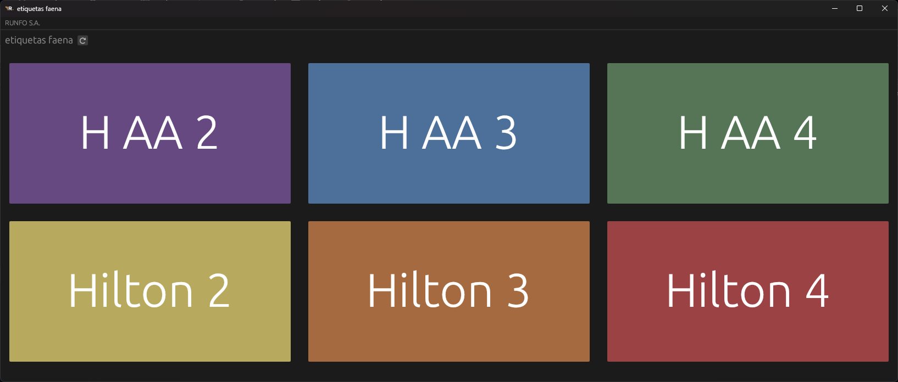

# Faenta Etiquetas

    

## Acerca:
Faena Etiquetas, es un programa pensando para simplificar el trabajo de los operadores en el sector de faena. La idea es que através de este programa puedan cambiar la etiqueta que se va a utilizar en las medias reses con tan solo apretar el boton correspondiente.

Este programa ofrece tambien control y asistencia al sector de Sistemas con una tabla intermedia con la cual pueden modificar que etiquetas estan disponibles, cuales son, nombre y color. Ademas de contar con un registro de errores (hubicado dentro de **_%appdata%/faena_etiquetas/logs_**) para facilitar el troobleshooting llegase a ocurrir.

    

